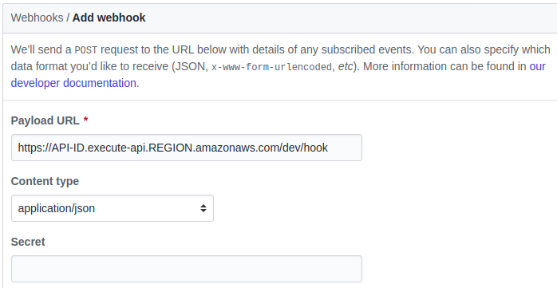
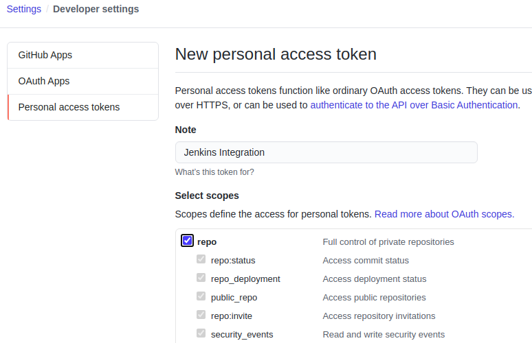
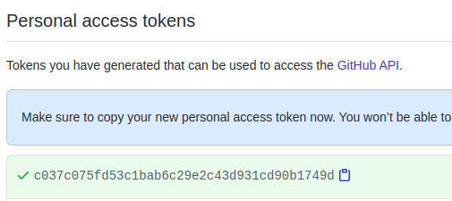
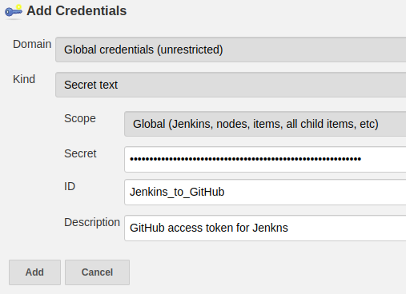
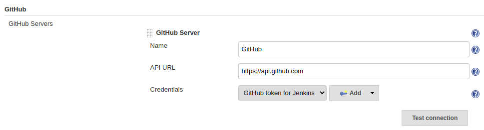
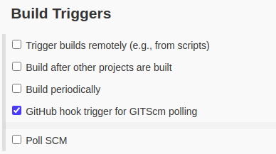
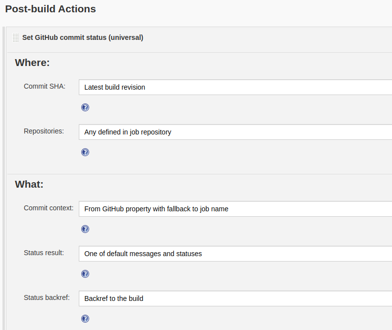

# Webhook-tunnel

[ngrok](https://ngrok.com/) is good to make a tunnel for private network.

But in my case, to make a hook between GitHub and Jenkins in my local, I worry few things below.

- Someone can guess my ngrok URL mapped brute force,
- and there is no way to protect my Jenkins access except Basic authentication supported by ngrok
- but that method cannot be supported by GitHub Webhook.

Of course, introducing nginx to expose only Jenkins' Webhook URL and use ngrok that path, everything would be alright. But I can only 1 online ngrok process under free plan.

So I made it.

## Architecture

```text
GitHub -> APIGW/λ -> SQS (Public network)
   (Private network) SQS <- polling server -> Jenkins
```

## Quick start

1. Copy from [.envrc.example](.envrc.example) to `.envrc` for environment variables. (feat. [direnv](https://direnv.net/))
2. Deploy [`github-to-sqs`](github-to-sqs) into AWS. (`yarn && yarn deploy`)
3. Make a hook between the deployed URL and GitHub repository. (GitHub Repository > Settings > Webhooks > Add webhook / Just the push event)  
   
4. Install Jenkins locally. (`docker run -p 8080:8080 jenkins/jenkins:lts`)
5. Setup [`sqs-to-local`](sqs-to-local) locally. (`yarn && yarn build && ./dist/main-linux`)
6. Generate GitHub Personal access token with `repo` scope. (GitHub > Settings > Developer settings > Personal access tokens > Generate new token > Select scopes / repo / repo:status)  
   
   
7. Add it to Jenkins. (Manage Jenkins > Configure > GitHub > GitHub Server / Credentials > Add / Secret text)  
   
   
8. Create a job and make some pushes!  
   
   

## Environment variables

Checkout [`.envrc`](.envrc.example) file please. These are common configurations.

| Name               | Description                    | Required | Default value |
| ------------------ | ------------------------------ | -------- | ------------- |
| TUNNEL_QUEUE_NAME  | Name of SQS to exchange events | true     |               |
| AWS_DEFAULT_REGION | SQS deployed AWS Region        | true     |               |

Other specific configuration would be placed each `.envrc.example` of subdirectory.
All subprojects have their `.envrc.example` to manage their specific configuration.

- [GitHub-to-SQS](github-to-sqs/.envrc.example)
- [SQS-to-Local](sqs-to-local/.envrc.example)

### Environment variables for logging

| Name              | Description                             | Required | Default value |
| ----------------- | --------------------------------------- | -------- | ------------- |
| CONSOLE_LOG_LEVEL | Log level for Console logging           | false    | trace         |
| SLACK_LOG_LEVEL   | Log level for Slack logging             | false    | warn          |
| SLACK_WEBHOOK_URL | Slack Incoming Webhook URL to send logs | false    | (undefined)   |
| SLACK_USERNAME    | Slack username for logging              | false    | Logger        |
| SLACK_CHANNEL     | Slack channel for logging               | false    | (undefined)   |

Sometimes cloudwatch is too slow. For this reason, using slack as a logger's destination is often very convenient.

## License

MIT
