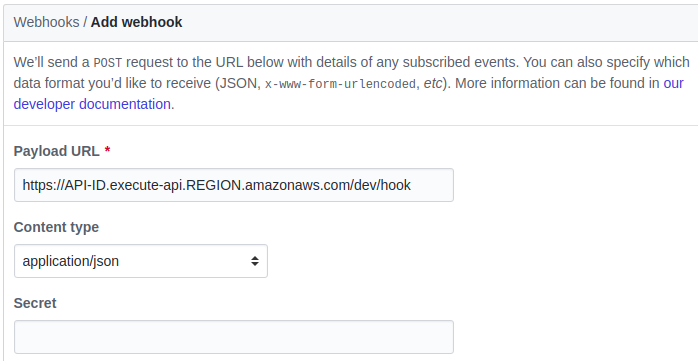

# GitHub to SQS

AWS Serverless API to receive events from GitHub and push them into SQS.

## Quick start

```bash
# Install dependencies.
yarn

# Deploy this stack into AWS.
yarn deploy
```

After that, we can get an Webhook URL which is deployed at AWS. Set it as GitHub Webhook URL and make any events such as a push commit, we can see those events are stored in SQS immediately.

```text
# We can this information using `yarn sls info`, too.
Service Information
service: webhook-tunnel
...
endpoints:
  POST - https://API-ID.execute-api.REGION.amazonaws.com/dev/hook
functions:
  webhook: webhook-tunnel-dev-webhook
```

GitHub Repository > Settings > Webhooks > Add webhook.



If we want to run CI on every commits, it is ok to use just the push event.

## Environment variables

### Common

It can be set from [`.envrc` file at parent directory](../.envrc.example).

| Name               | Description                    | Required | Default value |
| ------------------ | ------------------------------ | -------- | ------------- |
| TUNNEL_QUEUE_NAME  | Name of SQS to exchange events | true     |               |
| AWS_DEFAULT_REGION | SQS deployed AWS Region        | true     |               |

### for GitHub to SQS

It can be set from [`.envrc` file at current directory.](.envrc.example).

| Name                  | Description                         | Required | Default value |
| --------------------- | ----------------------------------- | -------- | ------------- |
| WEBHOOK_SECRET        | GitHub Webhook Secret               | false    | (undefined)   |
| AWS_ACCESS_KEY_ID     | AWS Access key to deploy this stack | true     |               |
| AWS_SECRET_ACCESS_KEY | AWS Access key to deploy this stack | true     |               |

### for Logging

It can be set from [`.envrc` file at parent directory](../.envrc.example). Or it can be overrided from [`.envrc` file at current directory.](.envrc.example).

| Name              | Description                             | Required | Default value |
| ----------------- | --------------------------------------- | -------- | ------------- |
| CONSOLE_LOG_LEVEL | Log level for Console logging           | false    | trace         |
| SLACK_LOG_LEVEL   | Log level for Slack logging             | false    | warn          |
| SLACK_WEBHOOK_URL | Slack Incoming Webhook URL to send logs | false    | (undefined)   |
| SLACK_USERNAME    | Slack username for logging              | false    | Logger        |
| SLACK_CHANNEL     | Slack channel for logging               | false    | (undefined)   |

## Stack

- API Gateway
- Lambda
- SQS
- IAM (to give proper permission to Lambda)
- CloudWatch (for logging)
- CloudFormation (for deployment)

Please use proper AWS profile or access key to access above components during deployment.

## License

MIT
